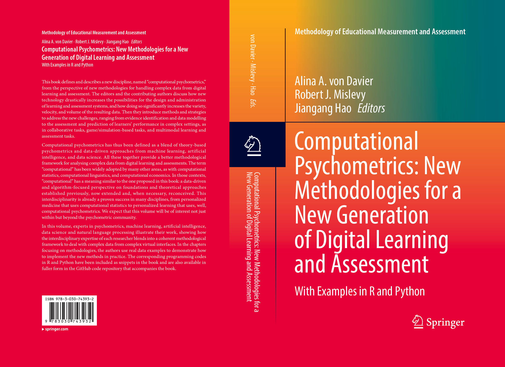

# Computational Psychometrics
This is the code repo for the forthcoming book, Computational Psychometrics, edited by Alina A. von Davier, Robert Mislevy and Jiangang Hao. Please note that only chapter 7 to chapter 14 contain code examples and the other chapters do not have any code examples. Click [here to visit the Springer page for the book](https://link.springer.com/book/9783030743932).

## Python and R Tutorials
* Python tutorials: https://docs.python.org/3/tutorial/
* R tutorials: https://cran.r-project.org/doc/manuals/r-release/R-intro.html

## Table of Contents

Chapter 1. Introduction to Computational Psychometrics: towards a principled integration of data science and machine learning techniques into psychometrics
> **Authors:**: Alina A. von Davier, Robert J. Mislevy and Jiangang Hao

> **Abstract:** In this chapter we articulate what is computational psychometrics, why
we need a volume focused on it, and how this book contributes to the expansion of
psychometric toolbox to include methodologies from machine learning and data
science in order to address the complexities of big data collected from virtual
learning and assessment systems. We also discuss here the structure of the edited
volume, how each chapter contributes to enhancing the psychometrics science and
our recommendations for further readings.

### Part I Conceptualization

Chapter 2. Next generation learning and assessment: what, why and how
> **Author:**: Robert Mislevy

> **Abstract:** Computational psychometrics is a blend of stochastic processes theory,
computer science-based methods, and theory-based psychometric approaches that
may aid the analyses of complex data from performance assessments. This chapter
discusses the grounds for using complex performance assessments, the design of
such assessments so that useful evidence about targeted abilities will be present
in the data to be analysed, and roles that computational psychometric ideas and
methods can play. It first provides background on a situative, sociocognitive,
perspective on human capabilities and how we develop them and use them—a
perspective we believe is necessary to synthesize the methodologies. Next it reviews
the form of evidentiary argument that underlies the evidence-centered approach
to design, interpretation, and use of educational assessments. It then points out
junctures in extensions of the argument form where computational psychometric
methods can carry out vital roles in assessment of more advanced constructs, from
more complex data, in new forms and contexts of assessment. It concludes by
reflecting on how one reconceives and extends the notions of validity, reliability,
comparability, fairness, and generalizability to more complex assessments and
analytic methods.

Chapter 3. Computational psychometrics 
> **Authors:** Alina A. von Davier, Kristen DiCerbo and Josine Verhagen

> **Abstract:** In recent years the advances in technology provided affordances for
learning and assessments opportunities. In this chapter we first describe computational
psychometrics as a framework for the measurement of learners’ skills,
knowledge, and abilities. We discuss the changes in educational measurement
that led to the need for expanding the psychometrics toolbox and describe the
properties of psychometric data. We then give an example of a class of models,
the Dynamic Bayesian Models that encompass many traditional psychometric
models and machine-learning algorithms. We conclude by emphasizing that model
complexity and power need to be balanced with the responsibility for transparency
and fairness towards stakeholders.

Chapter 4. Virtual performance-based assessments
> **Authors:** Jessica Andrews Todd, Robert Mislevy, Michelle LaMar and Sebastiaan de Klerk

> **Abstract:** Virtual performance-based assessments (VPBAs) are environments for
test takers to interact with systems, sometimes including other persons or agents,
in order to provide evidence about their knowledge, skills, or other attributes.
Examples include tasks based on interactive simulations, games, branching scenarios,
and collaboration among students communicating through digital chats. They
may be used for summative purposes, as in certification examinations, or for other
purposes, as in intelligent tutoring systems and exploratory learning environments.
They afford opportunities to obtain direct evidence about capabilities that inherently
involve interaction, such as inquiry and collaboration. Our focus here is digital,
usually with regard to the environment but always with regard to the form of
data. Digital data capture makes it possible to acquire rich details about students’
actions and the evolving situations in which they occur. The challenges they pose to
psychometrics lie in designing VPBAs to optimally evoke the targeted capabilities,
providing students with affordances that evidence that cognition, capturing the relevant
aspects of the performances, identifying meaningful patterns in performances
that constitute evidence about the targeted capabilities, and providing an inferential
framework for synthesizing the evidence and characterizing its properties. This
chapter provides an introduction to VPBAs and psychometric considerations in
VPBA design and analysis.

Chapter 5. Knowledge Inference Models Used in Adaptive Learning
> **Authors:** Maria Ofelia, M.O.Z. San Pedro and Ryan S. Baker

> **Abstract:** This chapter provides an overview of adaptive learning and examines
the student model component used in adaptive learning systems. Established and
more recent approaches to student modeling that infer student knowledge (i.e. what
students know at any given moment during the learning experience) are discussed,
as student knowledge is the most common learner characteristic widely assessed
in large-scale adaptive systems. This chapter concludes with a discussion of the
limitations of the current generation of adaptive learning systems, and areas of
potential for future progress.

### Part II Methodology

Chapter 6. Concepts and models from Psychometrics
> **Authors:** Robert Mislevy and Maria Bolsinova

> **Abstract:** The concepts and methods of psychometrics originated under trait and
behavioral psychology, with relatively simple data, used mainly for purposes of
prediction and selection. Ideas emerged over time that nevertheless hold value for
the new psychological perspectives, contexts of use, and forms of data and analytic
tools we are now seeing. In this chapter we review some fundamental models
and ideas from psychometrics that can be profitably reconceived, extended, and
augmented in the new world of assessment. Methods we address include classical
test theory, generalizability theory, item response theory, latent class models,
cognitive diagnosis models, factor analysis, hierarchical models, and Bayesian
networks. Key concepts are these: (1) The essential nature of psychometric models
(observations, constructs, latent variables, and probability-based reasoning). (2) The
interplay of design and discovery in assessment. (3) Understanding themeasurement
issues of validity, reliability, comparability, generalizability, and fairness as social
values that pertain even as forms of data, analysis, context, and purpose evolve.

Chapter 7. Bayesian Inference in Large-Scale Computational Psychometrics
> **Authors:** Gunter Maris, Timo Bechger and Maarten Marsman 

> **Abstract:** This chapter provides an introduction to Bayesian inference using
Markov Chain Monte Carlo (MCMC) methods. We focus on two popular MCMC
methods: Metropolis-Hastings and the Gibbs sampler. A Metropolis-Hastings
algorithm developed by Marsman et al. (Sci Rep 5:9050, 1–7, 2015) will be used
to illustrate how MCMC can be done for a wide range of models in computational
statistics.

Chapter 8. Data science perspectives
> **Authors:** Jiangang Hao and Robert Mislevy

> **Abstract:** Digitally based learning and assessment systems generate large volumes
of complex process data. The next generation psychometricians need to acquire new
data science skills to meet the data challenge. In this chapter, we summarize data
science skills and identify the subset that psychometricians need to prioritize. We
introduce an evidence identification centered data design (EICDD) process during
the task design, as an important way to address the data challenges from digitally
based assessments. We describe some specific data techniques to parse and process
complex process data with example codes in Python programming language. We
also outline the general methodological strategies when dealing with process data
from digitally based assessments.

Chapter 9. Supervised machine learning 
> **Author:** Jiangang Hao

> **Abstract:** Machine learning refers to a set of methodologies that allow computers
to “learn” the relationship among numerical representations of data. In this Chapter,
we focus on an important branch of machine learning, supervised machine learning,
and introduce three widely used supervised learning methods, the Support Vector
Machine, Random forest, and Gradient Boosting Machine. Python codes examples
are included to show how to use these methods in practice.

Chapter 10. Unsupervised machine learning
> **Author** Pak Chunk Wong

> **Abstract:** The chapter introduces the concept of machine learning with an emphasis
on unsupervised learning algorithms and applications. The discussion starts with a
brief background on machine learning and then a high-level discussion on the differences
between supervised and unsupervised learning algorithms. We present three
categories of unsupervised machine learning techniques that include clustering,
outlier detection, and dimension reduction; five prevailing unsupervised learning
algorithms that include K-means, agglomerative clustering, DBSCAN, principal
component analysis, and multidimensional scaling; and five Python programming
examples that demonstrate the learning concepts and results using psychometric
assessment data collected from an online collaborative problem-solving environment.
This chapter demonstrates the potential of machine learning and highlights
the opportunities it presents in psychometric research and development.

Chapter 11. AI and deep learning for educational research
> **Authors:** Yuchi Huang and Saad M. Khan

> **Abstract:** There is a growing need for assessment and learning tools that capture
a broad range of learner behavior necessary for the evaluation of skills such as
problem solving, communication and collaboration. In these real-world applications
student data is captured with a high degree of granularity, variety of temporal
scales and in a multitude of modalities. Unfortunately such complex, noisy and
unstructured data limit the applicability of traditional models of measurement and
psychometrics designed to extract evidence of competency from item response
data. In this chapter, we present recent advances in AI and Machine Learning
that can be utilized for measurement of a variety of complex constructs and
competencies. These models include frameworks such as deep neural networks and
adversarial generative networks that enable us to harness concept hierarchies and
the latent structure within data to learn increasingly complex representations and
make powerful predictions.

Chapter 12. Time series and stochastic processes 
> **Authors:** Peter Halpin, Lu Ou and Michelle LaMar

> **Abstract:** This chapter addresses some statistical modeling approaches for time
series data and discusses their potential for psychometric applications. We adopt a
broad conceptualization of time series, including under this rubric any type of data
that involves serial statistical dependence. Such dependence may be represented in
continuous time, discrete time, or in a purely sequential manner. This chapter begins
by discussing the relationships among these three representations and offers some
general advice on when each might prove useful. We then provide an overview of
three modeling frameworks that exemplify the different representations of statistical
dependence: Markov decision processes, state-space modeling, and temporal point
processes. For each modeling framework, we discuss its specification, its psychometric
interpretation, and provide a brief numeric example including R code.

Chapter 13. Social network analysis
> **Author:** Mengxiao Zhu

> **Abstract:** Supported by advances in technology, simulation-, scenario- and game-based assessments (DiCerbo & Behrens, 2012; Mislevy et al., 2014) provide opportunities for the students to interact with complex tasks. Rich process data can be collected during the assessment, such as log data of student response actions (e.g., Zhu, Shu, & von Davier, 2016), keystroke data (e.g., Almond, Deane, Quinlan, Wagner, & Sydorenko, 2012), and eye-tracking data (e.g., Tai, Loehr, & Brigham, 2006). Process data record the series of activities conducted by students during problem-solving processes and contain information not represented in the final answers. One useful direction in which to study process data is to explore how students transit from one action to other actions, or from one state to other states. In this chapter, we introduce the basic concepts and methods of Social Network Analysis (SNA) and discuss related applications in visualizing and analyzing process data using SNA to understand the transitions in response process data.

Chapter 14. Text mining and automated scoring 
> **Authors:** Michael Flor and Jiangang Hao

> **Abstract:** Natural Language Processing (NLP) is playing an increasingly important
role in learning and assessments. Some typical applications of NLP in education
include automated scoring, automated item generation, conversation-based assessments,
writing assistants, text mining for education, and so on. In this chapter,
we aim at introducing some basics of NLP through two typical applications in
educational contexts, text mining and automated scoring. We hope readers can get
an overall picture of NLP and get familiarized with some basic tools for handling
natural language data, which may serve as stepping stones for their future work with
NLP.

